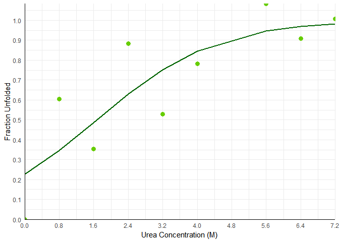
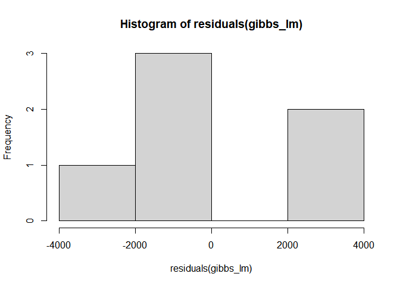
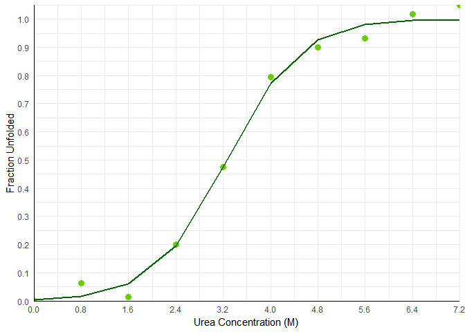
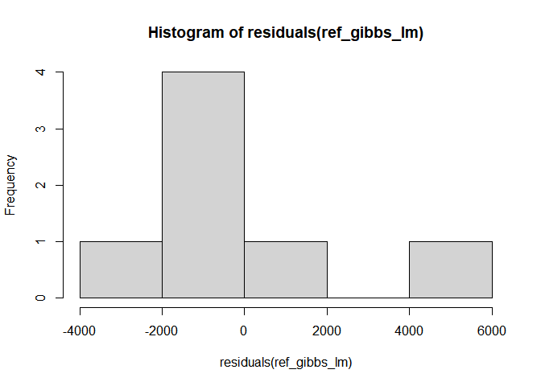
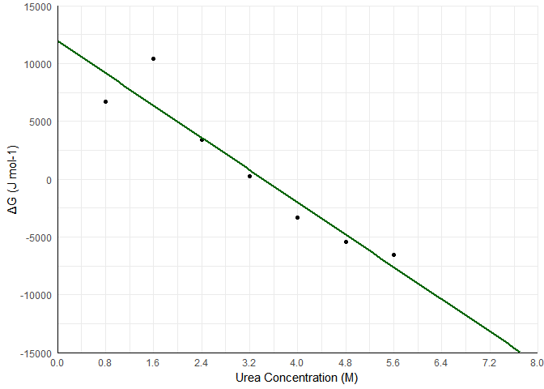

# GFPdenaturation
Data processing for the chemical denaturation of GFP
================
Erka Enkhbold

Loading of data for absorbance at 395nm.

``` r
abs_table <- read.csv("../data/exp_data.csv")
unfolded_abs <- mean(abs_table$Average[8:10]) # Assigning the average of 8x-10x as the absorbance of the unfolded state
native_abs <- abs_table$Average[1] # Assigning 1x as the absorbance of the native state
abs_table$fraction_unfolded <- 1 - (abs_table$Average - unfolded_abs)/(native_abs-unfolded_abs)

abs_table
```

Sample 7x seems off, so I will filter it out for analysis.

``` r
processed_abs <- abs_table[c(1:6,8:10),c(1,2,6,7)]
processed_abs
```

Performing a sigmoidal fit on our experimental data using a non-linear
least squares model.

``` r
library(minpack.lm)

sigmoidal_fit <- nlsLM(
  fraction_unfolded ~ 1 / (1 + exp(-m * (Final_urea_concentration - dfifty))),
  data = processed_abs,
  start = list(m = 0.1, dfifty = median(processed_abs$Final_urea_concentration))
)


summary(sigmoidal_fit)
```

    ## 
    ## Formula: fraction_unfolded ~ 1/(1 + exp(-m * (Final_urea_concentration - 
    ##     dfifty)))
    ## 
    ## Parameters:
    ##        Estimate Std. Error t value Pr(>|t|)  
    ## m        0.7288     0.3196   2.280   0.0566 .
    ## dfifty   1.6740     0.5482   3.053   0.0185 *
    ## ---
    ## Signif. codes:  0 '***' 0.001 '**' 0.01 '*' 0.05 '.' 0.1 ' ' 1
    ## 
    ## Residual standard error: 0.1994 on 7 degrees of freedom
    ## 
    ## Number of iterations to convergence: 8 
    ## Achieved convergence tolerance: 1.49e-08

Visualising our experimental data

``` r
library(ggplot2)

ggplot(data = processed_abs, aes(x = Final_urea_concentration, y = fraction_unfolded)) +
  geom_point(color = "chartreuse3", size = 3) +  # Scatter plot of data points
  theme_minimal()+
  theme(axis.line = element_line(color = "black",
                                 linewidth = 0.5,
                                 linetype = 1),
        
        )+
  
  geom_line(aes(y = predict(sigmoidal_fit)), color = "dark green", size = 1) +  # Fitted curve
  labs(
    x = "Urea Concentration (M)",
    y = "Fraction Unfolded"
  )+
  scale_y_continuous(breaks = seq(0, 1, by = 0.1), expand = c(0,0))+
  scale_x_continuous(breaks = seq(0, 8, by = 0.8), expand = c(0,0))
```

<!-- --> Data
processing for equillibrium constants and Gibbs Free Energy of each data
point

``` r
R <- 8.314  # J/(mol*K)
T <- 298.15 # Biochemical standard state (298.15 K)
abs_table$K <- abs_table$fraction_unfolded/(1-abs_table$fraction_unfolded)
abs_table$dGibbs <- -R*T*log(abs_table$K)
```

    ## Warning in log(abs_table$K): NaNs produced

``` r
gibbs_processed <- subset(abs_table, !is.na(abs_table$dGibbs) & !is.infinite(abs_table$dGibbs)) #filtering NaN and infinite values
gibbs_processed
```

Linear regression of the Gibbs free energy change

``` r
gibbs_lm <- lm(dGibbs~Final_urea_concentration, data = gibbs_processed)
summary(gibbs_lm)
```

    ## 
    ## Call:
    ## lm(formula = dGibbs ~ Final_urea_concentration, data = gibbs_processed)
    ## 
    ## Residuals:
    ##        2        3        4        5        6        9 
    ##  -886.65  2416.59 -3337.01  2109.08   -14.74  -287.26 
    ## 
    ## Coefficients:
    ##                          Estimate Std. Error t value Pr(>|t|)
    ## (Intercept)                 572.9     1893.4   0.303    0.777
    ## Final_urea_concentration   -929.3      531.4  -1.749    0.155
    ## 
    ## Residual standard error: 2361 on 4 degrees of freedom
    ## Multiple R-squared:  0.4333, Adjusted R-squared:  0.2916 
    ## F-statistic: 3.058 on 1 and 4 DF,  p-value: 0.1552

Testing the assumption of normal distribution of errors

``` r
hist(residuals(gibbs_lm))
```

<!-- -->

Loading, wrangling and fitting reference data

``` r
reference_data <- read.csv("../data/ref_data.csv")

ref_unfolded_abs <- mean(reference_data$Absorbance395[8:10]) # Assigning the average of 8x-10x as the absorbance of the unfolded state
ref_native_abs <- reference_data$Absorbance395[1] # Assigning 1x as the absorbance of the native state
reference_data$fraction_unfolded <- 1 - (reference_data$Absorbance395 - ref_unfolded_abs)/(ref_native_abs-ref_unfolded_abs)


ref_sigmoidal_fit <- nlsLM(
  fraction_unfolded ~ 1 / (1 + exp(-m * (Final_urea_concentration - dfifty))),
  data = reference_data,
  start = list(m = 0.1, dfifty = median(reference_data$Final_urea_concentration))
)
summary(ref_sigmoidal_fit)
```

    ## 
    ## Formula: fraction_unfolded ~ 1/(1 + exp(-m * (Final_urea_concentration - 
    ##     dfifty)))
    ## 
    ## Parameters:
    ##        Estimate Std. Error t value Pr(>|t|)    
    ## m       1.65416    0.15063   10.98 4.20e-06 ***
    ## dfifty  3.25780    0.06243   52.19 2.01e-11 ***
    ## ---
    ## Signif. codes:  0 '***' 0.001 '**' 0.01 '*' 0.05 '.' 0.1 ' ' 1
    ## 
    ## Residual standard error: 0.03665 on 8 degrees of freedom
    ## 
    ## Number of iterations to convergence: 9 
    ## Achieved convergence tolerance: 1.49e-08

Estimation of protein unfolding at 2, 4 and 6 M of urea.

``` r
q2_concs <- c(2, 4, 6)

df_q2_concs <- data.frame(
  Final_urea_concentration = q2_concs
)

predict(ref_sigmoidal_fit, newdata = df_q2_concs) #Refernce dataset predictions
```

    ## [1] 0.1109964 0.7734184 0.9893978

``` r
predict(sigmoidal_fit, newdata = df_q2_concs) #Experimental dataset predictions
```

    ## [1] 0.5591197 0.8449121 0.9590225

Visualising the reference data

``` r
library(ggplot2)

ggplot(data = reference_data, aes(x = Final_urea_concentration, y = fraction_unfolded)) +
  geom_point(color = "chartreuse3", size = 3) +  # Scatter plot of data points
  theme_minimal()+
  theme(axis.line = element_line(color = "black",
                                 linewidth = 0.5,
                                 linetype = 1),
        
        )+
  
  geom_line(aes(y = predict(ref_sigmoidal_fit)), color = "dark green", size = 1) +  # Fitted curve
  labs(
    x = "Urea Concentration (M)",
    y = "Fraction Unfolded"
  )+
  scale_y_continuous(breaks = seq(0, 1, by = 0.1), expand = c(0,0))+
  scale_x_continuous(breaks = seq(0, 8, by = 0.8), expand = c(0,0))
```

<!-- -->

``` r
ggsave("../results/ref_denaturation_curve.png", height = 7.47, width = 8.69, units = "cm")
```

Processing reference data for the Gibbs Free Energy

``` r
reference_data$K <- reference_data$fraction_unfolded/(1-reference_data$fraction_unfolded)
reference_data$dGibbs <- -R*T*log(reference_data$K)
```

    ## Warning in log(reference_data$K): NaNs produced

``` r
ref_gibbs_processed <- subset(reference_data, !is.na(reference_data$dGibbs) & !is.infinite(reference_data$dGibbs))
ref_gibbs_processed
ref_gibbs_lm <- lm(dGibbs~Final_urea_concentration, data = ref_gibbs_processed)
summary(ref_gibbs_lm)
```

    ## 
    ## Call:
    ## lm(formula = dGibbs ~ Final_urea_concentration, data = ref_gibbs_processed)
    ## 
    ## Residuals:
    ##       2       3       4       5       6       7       8 
    ## -2447.6  4057.3  -164.5  -544.4 -1333.8  -641.7  1074.8 
    ## 
    ## Coefficients:
    ##                          Estimate Std. Error t value Pr(>|t|)   
    ## (Intercept)               11968.9     1931.8   6.196  0.00160 **
    ## Final_urea_concentration  -3494.5      539.9  -6.472  0.00131 **
    ## ---
    ## Signif. codes:  0 '***' 0.001 '**' 0.01 '*' 0.05 '.' 0.1 ' ' 1
    ## 
    ## Residual standard error: 2286 on 5 degrees of freedom
    ## Multiple R-squared:  0.8934, Adjusted R-squared:  0.872 
    ## F-statistic: 41.89 on 1 and 5 DF,  p-value: 0.001312

``` r
confint(ref_gibbs_lm)
```

    ##                              2.5 %    97.5 %
    ## (Intercept)               7003.178 16934.676
    ## Final_urea_concentration -4882.494 -2106.556

Testing the assumption of normal distribution of errors

``` r
hist(residuals(ref_gibbs_lm))
```

<!-- -->

Visualising the Gibbs Free Energy distribution

``` r
ggplot(data = ref_gibbs_processed) + aes(x = Final_urea_concentration, y = dGibbs) + geom_point() + geom_smooth(method = "lm", se = FALSE, fullrange = TRUE, color = "dark green") + 
  theme_minimal()+
  theme(axis.line = element_line(color = "black",
                                 linewidth = 0.5,
                                 linetype = 1))+
  labs(x = "Urea Concentration (M)",y = "ΔG (J mol-1)")+
  scale_x_continuous(limits=c(0, 8), breaks=seq(0,8,0.8))+
  scale_y_continuous(limits=c(-15000, 15000), breaks=seq(-15000, 15000, 5000))+
  coord_cartesian(expand = FALSE)  
```

    ## `geom_smooth()` using formula = 'y ~ x'

    ## Warning: Removed 3 rows containing missing values or values outside the scale range
    ## (`geom_smooth()`).

<!-- -->

``` r
ggsave("../results/ref_gibbs.png", height = 7.47, width = 8.69, units = "cm")
```

    ## `geom_smooth()` using formula = 'y ~ x'

    ## Warning: Removed 3 rows containing missing values or values outside the scale range
    ## (`geom_smooth()`).

The linear model calculates a highly significant (p\<0.001) intercept of
11968 J mol-1, indicating a valid estimate of 12kJ mol-1 or 2.9 kcal
mol-1 for the Gibbs Free Energy change associated with GFP folding.
